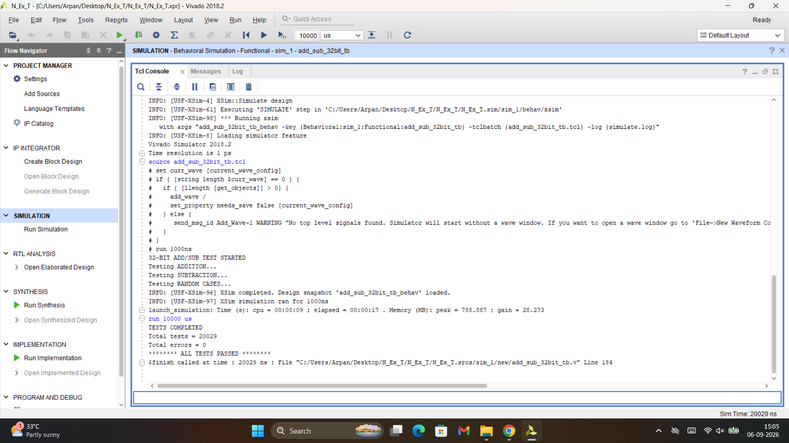

# 32-bit Signed Adder/Subtractor

A hierarchical 32-bit adder/subtractor designed and verified in **Verilog HDL** using four cascaded 8-bit adder/subtractor blocks.

## Overview

This project implements a 32-bit arithmetic unit capable of performing:

- 32-bit addition
- 32-bit subtraction using two's-complement arithmetic

The operation is selected using a single `control` input.

| Control | Operation |
|:---:|:---|
| `0` | A + B |
| `1` | A - B |

## Architecture

The 32-bit design is constructed using four cascaded 8-bit adder/subtractor blocks.

**Data path:**

`A[7:0], B[7:0]` → 8-bit Block 0 → `c1` → 8-bit Block 1 → `c2` → 8-bit Block 2 → `c3` → 8-bit Block 3 → `cout`

**Bit ranges:**

- Block 0: `7:0`
- Block 1: `15:8`
- Block 2: `23:16`
- Block 3: `31:24`

Each 8-bit block is constructed from eight full adders connected in a ripple-carry configuration.

## Addition

When `control = 0`, the circuit performs:

`A + B`

The initial carry-in is `0`.

## Subtraction

When `control = 1`, the circuit performs subtraction using two's-complement arithmetic:

`A - B = A + (~B) + 1`

The `control` signal is used to:

1. Invert every bit of `B`
2. Provide the initial carry-in of `1`

Therefore:

`control = 1` → `B` is inverted → initial carry = 1 → `A + ~B + 1` → `A - B`

## RTL Design

### Module Hierarchy

- `add_sub_32bit`
  - Four `add_sub_8bit` modules
    - Each `add_sub_8bit` contains eight `full_adder` modules

### Main Modules

| Module | Description |
|---|---|
| `full_adder` | Basic 1-bit full adder |
| `add_sub_8bit` | 8-bit configurable adder/subtractor |
| `add_sub_32bit` | Top-level 32-bit hierarchical design |

## Verification

The design was verified using a dedicated Verilog testbench in **Vivado Simulator**.

The testbench includes:

- Directed addition test cases
- Directed subtraction test cases
- Boundary-value test cases
- Pattern-based test cases
- Randomized testing

### Randomized Verification

The testbench performs:

- **10,000 random addition tests**
- **10,000 random subtraction tests**

along with additional directed test cases.

The expected result is generated using a reference model and compared against the DUT output.

The testbench reports the total number of tests and errors.

## Repository Structure

- `rtl/`
  - `full_adder.v`
  - `add_sub_8bit.v`
  - `add_sub_32bit.v`
- `simulation/`
  - `add_sub_32bit_tb.v`
- `README.md`

## Tools Used

- **HDL:** Verilog
- **Simulation:** Vivado Simulator
- **Design methodology:** Hierarchical RTL design

## Concepts Demonstrated

- Full-adder design
- Ripple-carry addition
- Hierarchical RTL design
- Two's-complement subtraction
- XOR-based conditional inversion
- Carry propagation
- Modular hardware design
- Verilog testbench development
- Directed verification
- Randomized verification

## Future Improvements

- Implement the design on a **Xilinx Basys3 FPGA**
- Add explicit signed/unsigned test coverage
- Investigate timing and maximum operating frequency after synthesis
- Explore faster adder architectures such as carry-lookahead or carry-select adders

## Verification

The design was verified using a Verilog testbench in Vivado XSim.

- Total test cases: **20,029**
- Total errors: **0**
- Result: **ALL TESTS PASSED**
- Verification includes directed and randomized test cases.

## Author

**Arpan Naskar**

  B.E. Electronics & Tele-Communication Engineering  
Jadavpur University

